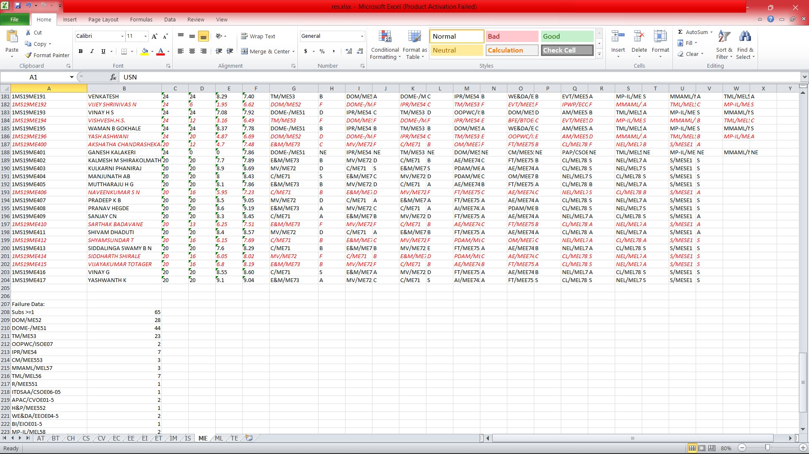
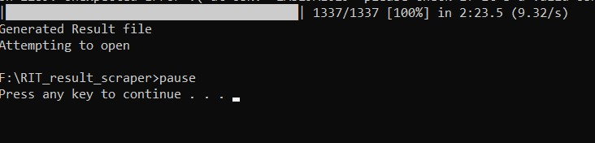

# RIT RESULT SCRAPER

A Result Scraping bot for MSRIT exam.msrit.edu portal, enabling proctors/HODs/staff/students to generate a detialed report of Sem-end Result for requiured students.


## Features

- Bypasses CAPTCHA
- Fast and effecient (Tested for 1337 students in 2:23:05 minutes)
- Divides data into different sheets based on Branch
- Highlights Students with 'I'/'F'/'X' grade
- Spreadsheet representation, making it easier for further computation
- computation of overall metrics like 'F'/'I'/'X' grades per subject, or no. of students failing one or more subject.


## Requirements
- python3
- software to open .xlsx sheets
## How to run
Clone this repo using code->download zip
OR
```
git clone https://github.com/mohakkhowal/RIT_result_scraper.git
```
Generate a .txt file in sample.txt like format
- Windows- Run 'windows_autorunner.bat'
- Others:  in Terminal: 
```
cd RIT_RESULT_SCRAPER
py -m pip install beautifulsoup4 requests openpyxl alive_progress
py bot.py
```

 
    
## Screenshots




